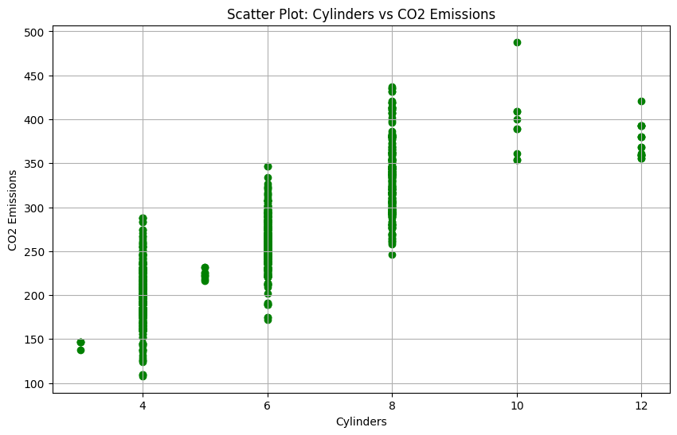
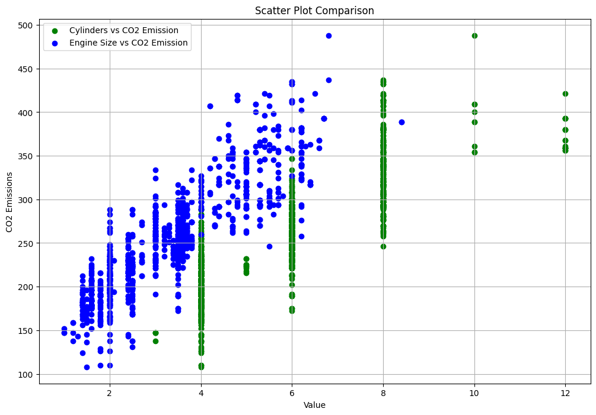
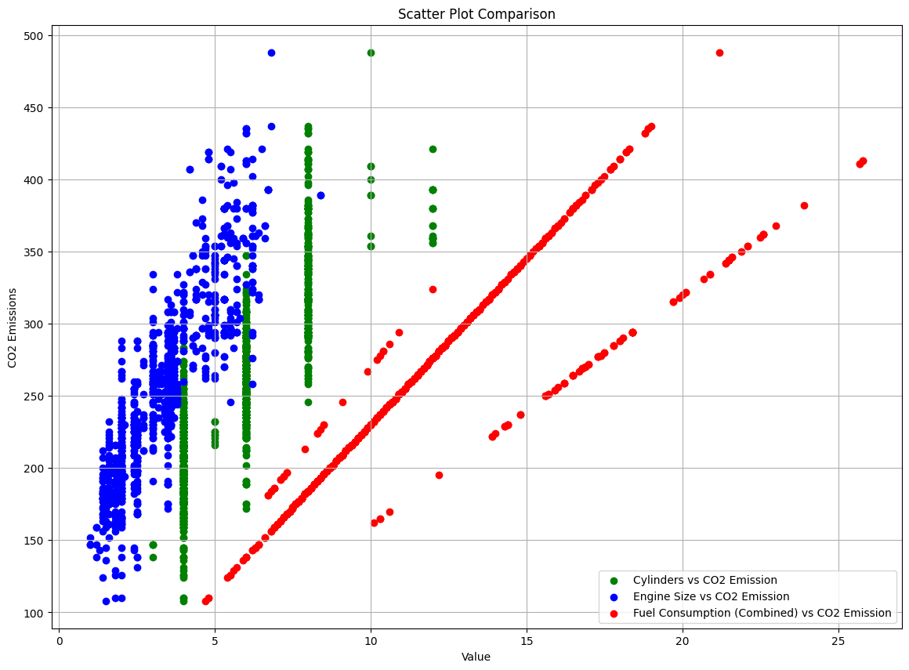
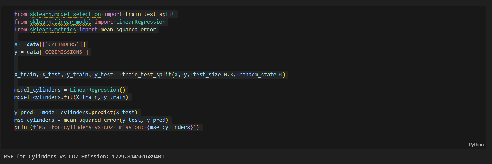
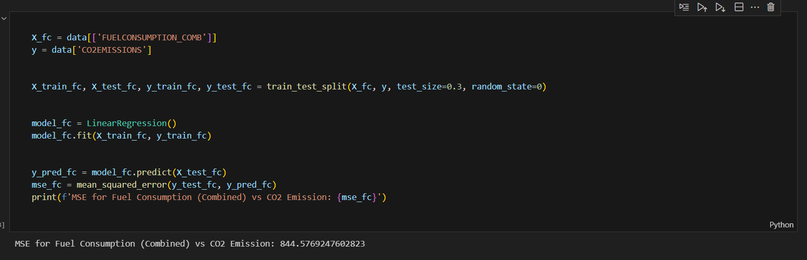
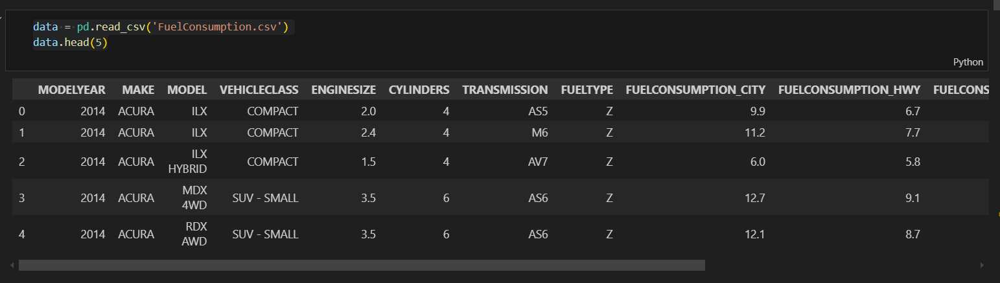

# ITRODUCTION MACHINE LEARNING
# SA -1

## Data set
```py
import pandas as pd
import matplotlib.pyplot as plt
import seaborn as sns

data = pd.read_csv('FuelConsumption.csv')
data.head(5)

```
## Q1. Create a scatter plot between cylinder vs Co2Emission (green color)
### program
```py
plt.figure(figsize=(10, 6))
plt.scatter(data['CYLINDERS'], data['CO2EMISSIONS'], color='green')
plt.title('Scatter Plot: Cylinders vs CO2 Emissions')
plt.xlabel('Cylinders')
plt.ylabel('CO2 Emissions')
plt.grid(True)
plt.show()
```
### output 


## Q2. Using scatter plot compare data   cylinder vs Co2Emission and Enginesize Vs Co2Emission using different color

### program
```py
plt.figure(figsize=(12, 8))

plt.scatter(data['CYLINDERS'], data['CO2EMISSIONS'], color='green', label='Cylinders vs CO2 Emission')

plt.scatter(data['ENGINESIZE'], data['CO2EMISSIONS'], color='blue', label='Engine Size vs CO2 Emission')

plt.title('Scatter Plot Comparison')
plt.xlabel('Value')
plt.ylabel('CO2 Emissions')
plt.legend()
plt.grid(True)
plt.show()

```
### output


## Q3. Using scatter plot compare data   cylinder vs Co2Emission and Enginesize Vs Co2Emission and FuelConsumption_comb Co2Emission using different colors


### program
```py
plt.figure(figsize=(14, 10))

plt.scatter(data['CYLINDERS'], data['CO2EMISSIONS'], color='green', label='Cylinders vs CO2 Emission')

plt.scatter(data['ENGINESIZE'], data['CO2EMISSIONS'], color='blue', label='Engine Size vs CO2 Emission')

plt.scatter(data['FUELCONSUMPTION_COMB'], data['CO2EMISSIONS'], color='red', label='Fuel Consumption (Combined) vs CO2 Emission')

plt.title('Scatter Plot Comparison')
plt.xlabel('Value')
plt.ylabel('CO2 Emissions')
plt.legend()
plt.grid(True)
plt.show()

```
### output

## Q4. Train your model with independent variable as cylinder and dependent variable as Co2Emission

### program
```py
from sklearn.model_selection import train_test_split
from sklearn.linear_model import LinearRegression
from sklearn.metrics import mean_squared_error

X = data[['CYLINDERS']]
y = data['CO2EMISSIONS']


X_train, X_test, y_train, y_test = train_test_split(X, y, test_size=0.3, random_state=0)

model_cylinders = LinearRegression()
model_cylinders.fit(X_train, y_train)

y_pred = model_cylinders.predict(X_test)
mse_cylinders = mean_squared_error(y_test, y_pred)
print(f'MSE for Cylinders vs CO2 Emission: {mse_cylinders}')

```
### output

## Q5. Train another model with independent variable as FuelConsumption_comb and dependent variable as Co2Emission

### program
```py

X_fc = data[['FUELCONSUMPTION_COMB']]
y = data['CO2EMISSIONS']


X_train_fc, X_test_fc, y_train_fc, y_test_fc = train_test_split(X_fc, y, test_size=0.3, random_state=0)


model_fc = LinearRegression()
model_fc.fit(X_train_fc, y_train_fc)


y_pred_fc = model_fc.predict(X_test_fc)
mse_fc = mean_squared_error(y_test_fc, y_pred_fc)
print(f'MSE for Fuel Consumption (Combined) vs CO2 Emission: {mse_fc}')

```
### output


## Q6. Train your model on different train test ratio and train the models and note down their accuracies


### program
```py
ratios = [0.2, 0.3, 0.4]
results = []

for ratio in ratios:
    X_train, X_test, y_train, y_test = train_test_split(X, y, test_size=ratio, random_state=0)
   
    model = LinearRegression()
    model.fit(X_train, y_train)

    y_pred = model.predict(X_test)
    mse = mean_squared_error(y_test, y_pred)
    results.append((ratio, mse))
    print(f'Train-Test Ratio: {ratio}, MSE: {mse}')

print("Train-Test Ratio vs MSE:")
for ratio, mse in results:
    print(f"Ratio: {ratio}, MSE: {mse}")

```
### output

